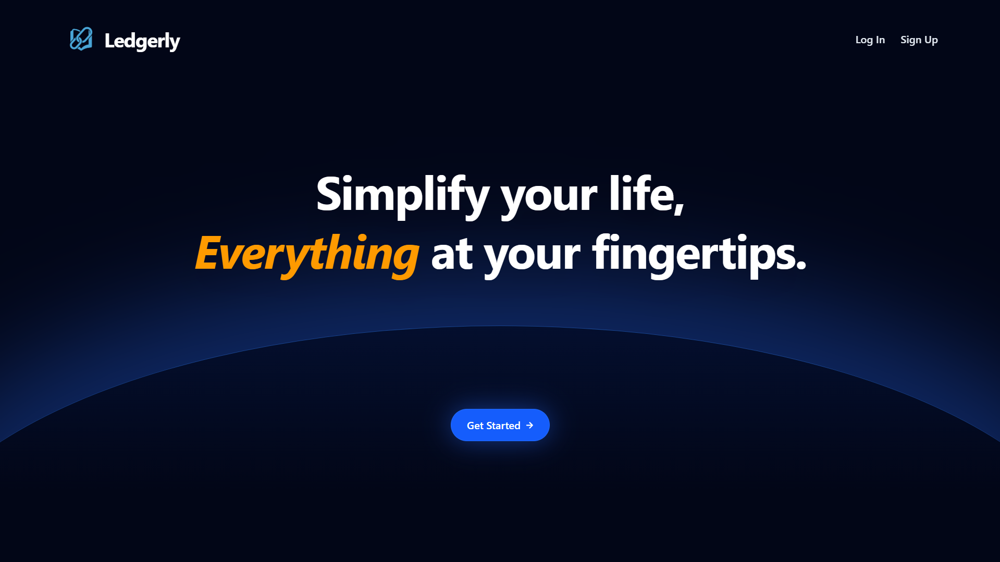

# Ledgerly - Smart Link Management & Organization



Ledgerly is a modern, full-stack MERN application designed to help users organize, categorize, and access their important links, tools, and resources efficiently. It features a stunning glassmorphism UI, secure authentication, and a robust set of tools for productivity.

## 🚀 Features

### Core Functionality
-   **Link Management:** Save, edit, and delete links with custom titles and descriptions.
-   **Collections (Stacks):** Organize links into custom "Stacks" for easy access on the Dashboard.
-   **Smart Categories:** Auto-categorization of links into predefined categories (Development, Design, Productivity, etc.).
-   **Quick Save:** Rapidly save links via a dedicated `/quick-save` route (optimized for bookmarklets/extensions).
-   **Starred Links:** Pin your most-used links for instant access.
-   **Vault:** Secure storage for sensitive links or notes (future implementations).

### User Experience
-   **Glassmorphism Design:** A premium, dark-themed UI with blur effects and smooth animations.
-   **Responsive Layout:** Fully optimized for desktop, tablet, and mobile devices.
-   **Keyboard Shortcuts:** Power-user friendly shortcuts (Press `?` to view).
-   **Search:** Instant global search across all your links and collections.

### Security & Accounts
-   **Authentication:** Secure login via Email/Password, Google OAuth, and GitHub OAuth.
-   **Password Management:** Reset forgotten passwords via email (Resend) and change passwords in Settings.
-   **JWT Sessions:** Secure, stateless authentication using JSON Web Tokens.

### Tools & Integrations
-   **Analytics:** Integrated Google Analytics (GA4) for usage tracking.
-   **Error Monitoring:** Sentry integration for real-time error tracking and performance monitoring.

## 🛠️ Tech Stack

-   **Frontend:** React (Vite), Tailwind CSS, Framer Motion, Axios.
-   **Backend:** Node.js, Express.js, Mongoose (MongoDB).
-   **Database:** MongoDB Atlas.
-   **Authentication:** Passport.js (Google/GitHub), BCrypt, JWT.
-   **Email Service:** Resend.
-   **Monitoring:** Google Analytics 4, Sentry.
-   **Hosting:** Vercel (Frontend), Render (Backend).

## 📦 Installation & Setup

1.  **Clone the Repository**
    ```bash
    git clone https://github.com/YOUR_USERNAME/Ledgerly.git
    cd Ledgerly
    ```

2.  **Install Dependencies**
    *   **Server:**
        ```bash
        cd server
        npm install
        ```
    *   **Client:**
        ```bash
        cd ../client
        npm install
        ```

3.  **Environment Variables**
    Create a `.env` file in `server/` and `client/` based on the `.env.example` files provided.
    
    *   **Server (.env):** `MONGO_URI`, `JWT_SECRET`, `GOOGLE_CLIENT_ID`, `GOOGLE_CLIENT_SECRET`, `GITHUB_CLIENT_ID`, `GITHUB_CLIENT_SECRET`, `RESEND_API_KEY`, `CLIENT_URL`.
    *   **Client (.env):** `VITE_API_URL`, `VITE_GA_MEASUREMENT_ID`, `VITE_SENTRY_DSN`.

4.  **Run Locally**
    *   **Server:** `npm start` (Runs on port 5000)
    *   **Client:** `npm run dev` (Runs on port 5173)

## 🤝 Contributing

Contributions are welcome! Please feel free to submit a Pull Request.

## 📄 License

This project is open-source and available under the MIT License.
